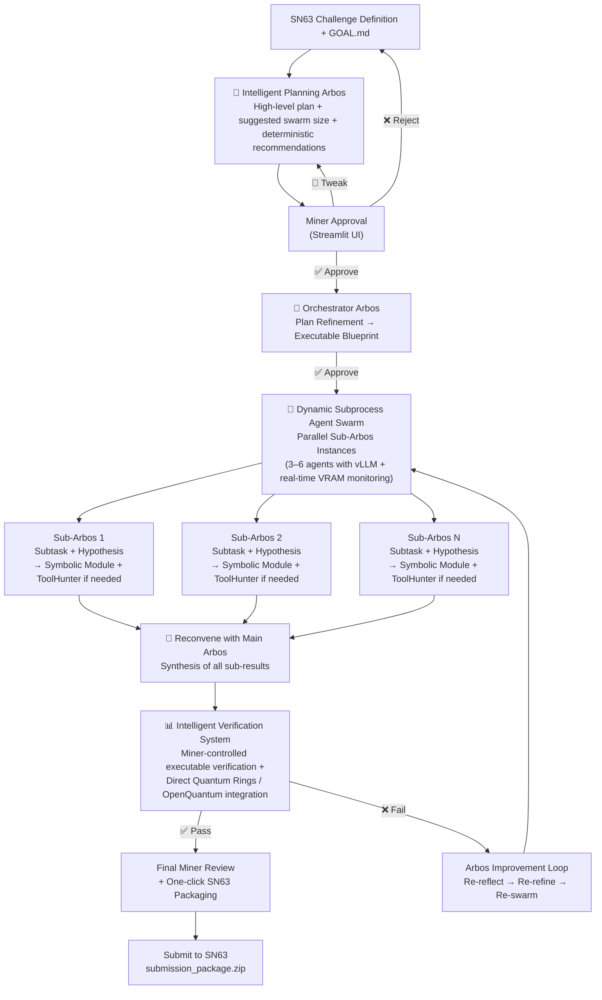

# Enigma Machine Miner – Bittensor SN63

**Arbos-centric primary solver with intelligent planning, dynamic vLLM swarm, VRAM monitoring, real-time ToolHunter, miner-controlled executable verification, and automatic deterministic/symbolic tooling**

The most intelligent and resource-efficient solo miner on Subnet 63, Enigma. 

Designed from first principles to solve extremely hard, well-defined computational challenges across quantum and any industry — within any strict compute limit set by the miner.

### Core Architecture – The Intelligent Loop



**Key Intelligence Highlights**

- **Full Miner Control** — Planning approval, post-planning deterministic tooling field, executable verification input, enhancement prompt, final review, and one-click packaging.
- **Intelligent Planning Arbos** creates the high-level strategy and **explicitly recommends deterministic/symbolic tools** (Stim for stabilizers, Quantum Rings for fidelity, PyTKET for circuit optimization, SymPy for symbolic Pauli).
- **Miner-Controlled Deterministic Tooling** — After seeing Arbos recommendations in the planning approval screen, the miner can add or override specific tooling requirements before the swarm runs.
- **Miner Enhancement Prompt (10/10 Instructions)** — Dedicated field in the planning approval screen where the miner can give final custom instructions to push the entire run to maximum quality (tool priorities, novelty focus, synthesis style, verifier strength, IP/licensability, etc.). These instructions are injected into refinement and synthesis.
- **Orchestrator Arbos** takes the approved plan and refines it into an executable blueprint, assigning subtasks, swarm configuration, tool_map, and model classes while incorporating miner deterministic tooling and enhancement instructions.
- **Dynamic Parallel Subprocess Agent Swarm** with **per-subtask ToolHunter** — Each Sub-Arbos independently explores hypotheses and can call ToolHunter for gaps in real time.
- **Automatic Symbolic Reasoning Module** — Arbos swarm now **automatically calls** deterministic/symbolic logic in `_sub_arbos_worker` for matching subtasks (stabilizer checks, fidelity estimation, circuit optimization, preprocessing). LLM is used only when truly needed.
- **Intelligent Verification System** — Miner can provide custom executable verification code or instructions. The system supports **direct Quantum Rings and OpenQuantum SDK integration** for real simulator execution and deterministic metrics (fidelity, shots, pass/fail). Verification results are fed back into the quality gate and final synthesis.
- **Adaptive Re-loop & Memory** — Strong long-term memory across loops with explicit meta-reflection on failures. This is stored and used on future challenges. The miner keeps getting smarter and more efficient with every run.

### How Deterministic Tooling Works

1. Planning Arbos analyzes the challenge and shows clear deterministic tool recommendations.
2. Miner reviews them and can immediately add/edit "Deterministic Tooling Requirements" (e.g., "Use stim for stabilizer checks. Prefer symbolic fallbacks. Run fidelity simulation with quantum_rings.").
3. Miner has time to install any recommended tools.
4. When approved, Arbos automatically uses the symbolic module **and** respects the miner-specified preferences in the parallel swarm.

### Miner Enhancement Prompt (Make this a 10/10 run)

In the planning approval screen there is a dedicated field titled **"🚀 Miner Enhancement Prompt (Make this a 10/10 run)"**.

Use it to give Arbos any final custom instructions, such as:
- Tool priorities or constraints
- Desired focus (novelty, verifier strength, IP/licensability, efficiency, etc.)
- Synthesis preferences
- Swarm behavior adjustments
- Any other challenge-specific guidance

These instructions are automatically injected into the Orchestrator refinement and final synthesis so Arbos respects them throughout the entire run.

### GOAL.md / killer_base.md Configuration

```markdown
# Enigma Machine Miner - Killer Base Strategy & Toggles
# Bittensor SN63 - Arbos-centric Solver

## GOAL
Solve the sponsor challenge with maximum novelty and verifier score while staying under the *DESIRED COMPUTE LIMIT*.

## Core Strategy (Miner Customizes)
Produce novel, verifier-strong, licensable solutions for SN63 challenges while staying strictly within compute limits and maximizing IP/value.

Always prioritize:
- High novelty + verifier potential on Quantum Rings
- Efficient use of compute
- Clear, reproducible outputs

## Toggles & Explanations

### Core Behavior
miner_review_after_loop: false     # true = pause after every major loop for miner input
max_loops: 5                       # Maximum automatic loops when review is off
miner_review_final: true           # Always require final miner review before submission

### Compute & Resource Management
max_compute_hours: 3.8             # Dynamic maximum compute time for the entire challenge
resource_aware: true               # Actively enforces time budgets, early aborts slow branches, adjusts swarm size

### Safety & Quality
guardrails: true                   # Applies output cleaning and sanity checks after each sub-Arbos and final synthesis

### ToolHunter
toolhunter_escalation: true        # Enables ToolHunter to generate manual recommendations on failure
manual_tool_installs_allowed: true # Shows manual installation instructions when needed

### Routing & LLM
chutes: true
chutes_llm: Claude

### Swarm Efficiency (vLLM)
tensor_parallel_size: 1            # Set to 2 or 4 if you have multiple GPUs. Keep 1 for single H100
vllm_model: mistralai/Mistral-7B-Instruct-v0.2   # Change this to any model you want to use with vLLM

```

### Quick Start

```bash
pip install -r requirements.txt
pip install vllm                    # Strongly recommended
streamlit run streamlit_app.py
```

(Optional: Add `GITHUB_TOKEN` to `.env` for richer ToolHunter searches. Install `stim`, `qiskit`, `pytket`, or `quantumrings` as needed for maximum deterministic performance.)

### Why This Wins on SN63

- True intelligent decomposition with **Arbos-driven deterministic recommendations**
- **Parallel per-subtask ToolHunter** combined with automatic symbolic reasoning significantly reduces LLM reliance
- **Intelligent verification system** with direct Quantum Rings/OpenQuantum support and miner-controlled executable code
- Miner has precise control over verification, deterministic tooling, **and** final enhancement instructions
- Strong resource awareness (real-time VRAM, dynamic scaling, strict compute limits)
- Closed-loop reflection with long-term memory and full transparency

**Phase 2 ready.**

---

Made with focus on first-principles agentic design for Bittensor SN63.  
Questions or feature requests? Open an issue or ping @dTAO_Dad on X.
```
