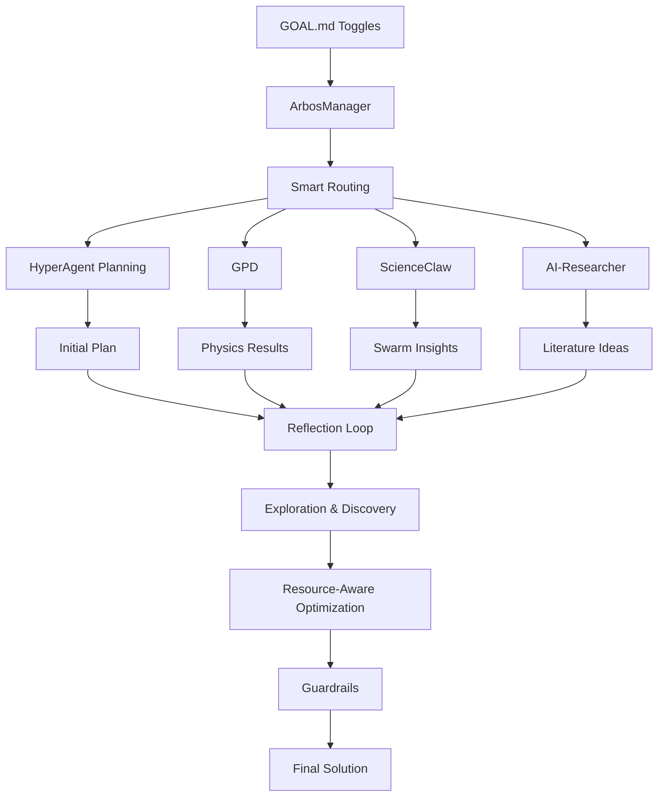

# Enigma Machine – Agentic Miner Starter Kit for SN63

**The easiest way to build a winning miner for Enigma** — the decentralized innovation engine where anyone posts capital and “impossible” problems, and miners compete to solve them in ≤4 hours on a single H100 GPU.

**Powered by Arbos + 8 proven agentic patterns.**  
Everything is **100% optional** and miner-customizable. No black boxes. No forced settings.

### Two Modes – Your Choice
- **Optimal Mode** → One-click team-curated best stack (great for beginners)  
- **Self-Built Mode** → Full control — tune or disable anything (where top miners create their edge)

---

### Quickstart (5 minutes)

```bash
git clone https://github.com/YOUR-USERNAME/enigma-machine.git
cd enigma-machine
pip install -e .
```

1. Edit `config/miner.yaml` (your wallet + subnet details)  
2. Choose mode in `config/arbos.yaml`:
   ```yaml
   mode: optimal          # or "self-built"
   ```
3. Pick or create a GOAL.md (see templates below)  
4. Run: `./scripts/run_miner.sh`

---

### The 8 Core Patterns – All Optional & Easy to Tune

| Pattern                        | What it does for you                                      | Impact if enabled                              | One-line toggle in GOAL.md                    | Default |
|--------------------------------|-----------------------------------------------------------|------------------------------------------------|-----------------------------------------------|---------|
| **Reflection**                 | Agent self-critiques and improves its own output          | +3–5× quality & prize win rate                 | `reflection: 4` (or `false`)                  | 3       |
| **Planning**                   | Breaks challenge into smart sub-tasks                     | Fewer wasted loops, better efficiency          | `planning: true` (or `false`)                 | true    |
| **HyperAgent Planning**        | Uses Facebook HyperAgent for intelligent self-improving plans | Much smarter planning for complex challenges   | `hyper_planning: true` (or `false`)           | false   |
| **Multi-Agent**                | Runs ScienceClaw-style swarm of specialized agents        | Massive parallel breakthroughs                 | `multi_agent: true` + `swarm_size: 20`        | true    |
| **Tool Use**                   | Smartly calls GPD, AI-Researcher, etc.                    | Better tool selection & fewer errors           | `tool_use: true` (or `false`)                 | true    |
| **Resource-Aware Optimization**| Tracks time & auto-compresses to stay under 4h H200     | **Required for prize eligibility**             | `resource_aware: true` (or `false`)           | true    |
| **Exploration & Discovery**    | Generates truly novel variants others miss                | Higher novelty = bigger prize wins             | `exploration: true` (or `false`)              | false   |
| **Guardrails**                 | Hard safety checks (runtime, quality, verifier score)     | Prevents disqualification                      | `guardrails: true` (or `false`)               | true    |

### Where to Edit – Super Simple Breakdown

| What you want to change                  | Where you edit it                              | How easy?          |
|------------------------------------------|------------------------------------------------|--------------------|
| Toggle patterns on/off or change numbers | `goals/your_strategy.md` (your GOAL.md file)   | Just edit text     |
| Change default values for new GOALs      | `config/arbos.yaml`                            | One line change    |
| Modify how a tool works                  | `agents/tools/*.py`                            | Edit Python (optional) |

---

### How the Patterns Work Together



---

### Killer GOAL.md Template (Copy & Customize)

Copy this into `goals/killer_base.md`:

```markdown
GOAL: Solve the sponsor challenge with maximum novelty and verifier score while staying under 3.8h on H200.

reflection: 4
planning: true
hyper_planning: false
multi_agent: true
swarm_size: 20
exploration: true
resource_aware: true
guardrails: true

Steps per Ralph loop:
1. Plan the attack (HyperAgent if hyper_planning: true)
2. Execute with smart tool routing
3. Reflect and improve
4. Explore one novel variant
5. Resource check + compress if needed
```

---

Ready to dominate Enigma?  
Fork the repo, create your first custom GOAL.md, and start competing.

$TAO 🚀
