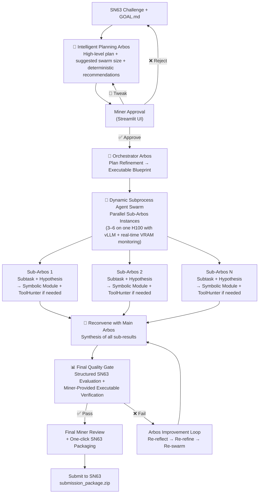

# Enigma Machine Miner – Bittensor SN63

**Arbos-centric primary solver with intelligent planning, dynamic vLLM swarm, real-time ToolHunter, miner-controlled executable verification, and automatic deterministic/symbolic tooling**

The most intelligent and resource-efficient solo miner on Subnet 63 (Quantum Innovate / qBitTensor Labs). Designed from first principles to solve extremely hard, well-defined computational challenges across quantum and any industry — within the strict ~4-hour H100 limit.

### Core Architecture – The Intelligent Loop



**Key Intelligence Highlights**
- **Planning Arbos** analyzes the challenge and **recommends deterministic/symbolic tools** (e.g., Stim for stabilizers, Quantum Rings for fidelity, PyTKET for optimization).
- **Miner-Controlled Deterministic Tooling** — After seeing recommendations, the miner can add/edit specific tooling requirements before the swarm runs. This gives time to install missing packages.
- **Automatic Symbolic Module** — Arbos now calls deterministic/symbolic reasoning **automatically** in sub-Arbos workers for matching subtasks (stabilizer checks, fidelity estimation, circuit optimization, preprocessing).
- **Direct Quantum Rings & OpenQuantum Support** — Built into the verification engine for real simulator execution.
- **Hybrid Reasoning** — Prefers deterministic tools first, falls back to LLM only when necessary.
- **Resource Awareness** — Real-time VRAM monitoring, dynamic tensor parallelism, early aborts, and compute limits.

### How Deterministic Tooling Works

1. Planning Arbos shows recommendations in the Streamlit approval screen.
2. Miner reviews and adds "Deterministic Tooling Requirements" (e.g., "Use stim for stabilizer checks. Run fidelity with quantum_rings. Prefer symbolic fallbacks.").
3. Miner installs any missing tools while reviewing.
4. When approved, Arbos automatically uses the symbolic module and miner-specified tools where applicable.

### GOAL.md / killer_base.md Configuration

```markdown
## Core Toggles (Actively Used)

resource_aware: true               # Enforces time budgets and early aborts
guardrails: true                   # Output cleaning and sanity checks
toolhunter_escalation: true
manual_tool_installs_allowed: true

miner_review_after_loop: false
max_loops: 5
miner_review_final: true

max_compute_hours: 3.8
chutes: true
chutes_llm: mixtral

# Swarm Efficiency
tensor_parallel_size: 1
```

### Quick Start

```bash
pip install -r requirements.txt
pip install vllm                    # Strongly recommended for swarm performance
streamlit run streamlit_app.py
```

(Optional: Add `GITHUB_TOKEN` to `.env` for richer ToolHunter searches. Install `stim`, `qiskit`, `pytket`, or `quantumrings` as needed for full deterministic power.)

### Why This Wins on SN63

- Strong intelligent decomposition with **Arbos-driven deterministic recommendations**
- Miner has precise control over both verification **and** deterministic tooling
- Automatic symbolic reasoning reduces LLM reliance on standard tasks
- Parallel hypothesis exploration with per-subtask ToolHunter + vLLM efficiency
- Real-time VRAM monitoring and strict compute awareness
- Full transparency, memory-driven learning, and one-click packaging

**Ready for Phase 2.**

---

Made with focus on first-principles agentic design for Bittensor SN63.  
Questions or feature requests? Open an issue or ping @dTAO_Dad on X.
```
