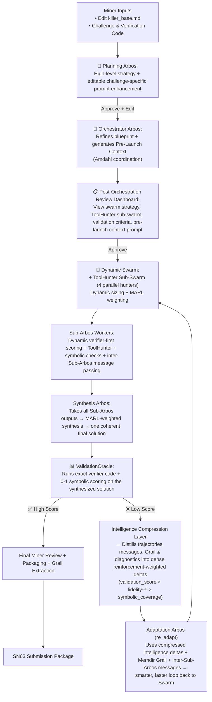

# THE ENIGMA MACHINE – Arbos-Led Intelligent Solver

**English-first • Verifier-first • Self-evolving • Challenge-agnostic mining swarm**

Built from first principles to solve extremely hard sponsor challenges — quantum, cryptographic, mathematical, symbolic, or any well-defined problem — while maximizing novelty, ValidationOracle score, and reproducible IP.

### Miner Execution Flow

1. **Edit `killer_base.md`** — your single source of truth containing the agnostic base strategy, toggles, and English Evolution Modules.
2. **Enter the challenge + verification instructions**.
3. **Click “Generate High-Level Plan”** → Planning Arbos creates a detailed strategy and **auto-populates** a challenge-specific post-planning enhancement.
4. **Review & edit** the auto-generated Enhancement Prompt to inject your own intelligence.
5. **(Optional)** Save the edited enhancement as a Grail pattern — it appends to `killer_base.md` and stores in `memdir/grail` for future compounding.
6. **Approve the Plan** → Orchestrator Arbos refines the blueprint and generates an even-more-specific Pre-Launch Context.
7. **Post-Orchestration Review Dashboard** — Examine the full swarm strategy, ToolHunter sub-swarm recommendations, validation criteria, and pre-launch context. Override or approve before launch.
8. **Launch the Swarm** → Dynamic Swarm + coordinated ToolHunter sub-swarm (ModelHunter / ToolHunter / PaperHunter / ReadyAI-DataHunter) with Amdahl-aware parallelism.
9. **Sub-Arbos Execution** — Each worker performs dynamic verifier-first scoring, ToolHunter calls, hypothesis exploration, and can post high-value discoveries to other workers via the lightweight inter-Sub-Arbos message bus.
10. **Synthesis Arbos** — Aggregates all Sub-Arbos outputs (including inter-Sub-Arbos messages), applies MARL credit assignment weighted strictly by ValidationOracle fidelity and determinism, and produces one coherent final solution.
11. **ValidationOracle** — The final gate. Executes your exact verifier code + symbolic 0-1 checks on the synthesized solution. Only high-fidelity paths advance.
12. **Low Score?** → Adaptation Arbos (`re_adapt`) automatically loops back using trajectory_vector_db + Memdir Grail recall + recent inter-Sub-Arbos messages + score+fidelity-weighted intelligence until the score improves or the compute limit is reached.
13. **High Score?** → Grail auto-extraction + one-click SN63 packaging.

Your edits and saved Grail patterns **compound** — the miner becomes smarter and more precise with every strong run.

### System Architecture



### Key Intelligence (in system flow order)

1. **Miner Control & GOAL.md** — Single source of truth. Full control over base strategy, toggles, model/compute choices, and Evolution Prompts.

2. **Planning Arbos** — Generates high-level strategy and automatically creates a challenge-specific post-planning enhancement prompt.

3. **Enhancement Prompt Layer** — Auto-generated and fully editable. Your custom instructions propagate through all phases.

4. **Orchestrator Arbos** — Refines the plan into an executable blueprint with decomposition, swarm config, tool_map, validation criteria, and a specialized Pre-Launch Context Prompt.

5. **Post-Orchestration Review Dashboard** — Critical visibility step. Review the complete swarm strategy, ToolHunter sub-swarm recommendations, validation criteria, and editable pre-launch context prompt before committing compute.

6. **Dynamic Swarm + ToolHunter Sub-Swarm** — Parallel execution with four coordinated hunters. Amdahl-aware routing prevents common multi-agent pitfalls.

7. **Sub-Arbos Workers** — Each performs dynamic verifier-first scoring, ToolHunter integration, hypothesis diversity, symbolic checks, and can post high-value discoveries to other workers via the lightweight inter-Sub-Arbos message bus.

8. **Synthesis Arbos** — Takes outputs from all Sub-Arbos workers (including inter-Sub-Arbos messages), applies strict MARL credit assignment (weighted only by ValidationOracle fidelity and determinism), and produces one coherent final solution.

9. **ValidationOracle** — The unbreakable gate. Executes your exact verifier code snippets + SymPy invariants + 0-1 edge-case checks on the synthesized solution.

10. **AgentFixer-style Diagnostics** — Rich multi-detector failure analysis (symbolic invariants, prompt coherence, parsing, novelty drift) now feeds directly into Grail consolidation and re_adapt, turning silent failures into precise, self-improving adaptations.

11. **Intelligence Compression Layer** — Before any high-level reasoning (especially re_adapt and Adaptation Arbos), raw trajectories, messages, Grail artifacts, and diagnostics are distilled by the evolving **COMPRESSION_PROMPT**. This produces dense, reinforcement-weighted intelligence deltas (`validation_score × fidelity¹·⁵ × symbolic_coverage`) with explicit meta-lessons and policy updates — slashing context bloat while amplifying signal.

12. **Adaptation Arbos Loop** — When ValidationOracle score is low, `re_adapt` intelligently pulls **compressed intelligence deltas** from trajectory_vector_db + Memdir Grail + recent messages. This enables faster, higher-precision adaptations with far less token waste.

13. **Grail + Reinforcement & Outer Evolution** — High-value symbolic patterns are automatically extracted and reinforced using the MemFactory-inspired signal (`score × fidelity¹·⁵ × symbolic_coverage`). On strong runs the **compression prompt itself** evolves via memory RL and is appended back to `killer_base.md`, turning the input pipeline into a self-improving intelligence filter that compounds across runs while keeping context windows light and effective.

### Maximum Heterogeneity Principle – The Core Scaling Strategy

**This is the hidden engine that makes the system win on problems with no obvious solutions.**

The **Principle of Maximum Heterogeneity** is now a first-class thesis pillar. Every major decision point is deliberately diversified across five axes:

- Agent diversity  
- Hypothesis diversity  
- Tool-path diversity  
- Interaction-graph diversity  
- Compute-substrate diversity  

**Why this strategy wins:**

Hard challenges have no single “correct” path. Traditional swarms collapse into mode-collapse or local optima. Heterogeneity forces the miner to explore the **full solution space** while the verifier-first gate ensures only high-fidelity paths survive.

Heterogeneity scoring runs on every Grail extraction and re_adapt. Adaptive EMA weights automatically reinforce the axes that actually move ValidationOracle scores. Stale-regime detection (z-score + prolonged-low) triggers **Deep Replan** when progress plateaus — generating an entirely new strategic avenue while preserving all prior Grail knowledge.

A heterogeneity bonus is baked into reinforcement signals and compression deltas, so the system learns to favor diverse trajectories over time. This is why the Enigma Machine scales on open-ended, high-difficulty problems while staying 100% verifier-gated, deterministic, and reproducible.

### Bittensor Subnet Inspired Intelligence

- **SN11 TrajectoryRL** — Trajectory optimization & policy learning  
- **SN33 ReadyAI** — Structured high-quality data for our agents  
- **SN24 Quasar** — Long-context attention & massive context handling  
- **SN64 Chutes** — Decentralized serverless AI compute  
- **SN81 Grail** — Verifiable reinforcement learning & post-training 

This turns raw subnet intelligence into a cryptographically inspired, verifiable self-improvement loop that compounds intelligence across runs.

### Prompt Evolution Intelligence
The system is powered by layered, compounding English prompts.  
`killer_base.md` provides the challenge-agnostic foundation and English Evolution Modules.  
Planning Arbos specializes it into a challenge-specific post-planning enhancement.  
Orchestrator Arbos further refines it into a pre-launch context.  
You can edit any generated prompt and save it as a **Grail pattern**, which is automatically appended to `killer_base.md` and stored in `memdir/grail`.  

This intelligence compounds from loop to loop via Adaptation Arbos, and each new run begins with richer, proven context — allowing the miner to evolve its own intelligence across challenges without modifying any Python code.

### Strict Verification Intelligence at Every Level
Verification is enforced at every stage, not added at the end:  
- Sub-Arbos workers operate verifier-code-first with dynamic symbolic checks.  
- Synthesis Arbos only credits paths meeting strict MARL thresholds (≥0.88 symbolic fidelity, ≥0.85 determinism).  
- ValidationOracle executes your exact verifier code + SymPy invariants + 0-1 edge-case assertions on the final synthesized solution.  
- Low-scoring paths are rejected and routed to Adaptation Arbos.  

No solution reaches final review or SN63 submission unless it survives this rigorous, deterministic gate. This is the single biggest differentiator from typical LLM swarms.

### Inner Loop Intelligence (Per-Run / Within-Task Evolution)

The **inner loop** focuses on rapid, high-fidelity problem-solving **within a single mining run or adaptation cycle**. This is where the Arbos swarm (Planning → Orchestration → ToolHunter sub-swarms → Synthesis) executes, verifies via ValidationOracle, and adapts in real time.

**Key mechanisms**:
- Verifier-first symbolic execution (`symbolic_module`) and deterministic checks.
- Eggroll-style low-rank perturbations for novelty.
- MARL-weighted credit assignment across sub-Arbos and ToolHunter.
- Dynamic resource-aware swarm sizing + Amdahl coordination.
- `re_adapt()` triggered on low ValidationOracle scores, incorporating diagnostics, fix recommendations, Grail patterns, and recent messages.

**Integrated Intelligence Compression Layer**  
All raw inputs are passed through `compress_intelligence_delta()` before reaching Adaptation Arbos. This produces dense, reinforcement-weighted intelligence deltas (`validation_score × fidelity^1.5 × symbolic_coverage`). Context size drops 60-75% while signal density increases. `re_adapt()` now receives clean, high-value input instead of noisy raw dumps.

### Outer Loop Intelligence (Cross-Run / Persistent Evolution)

The **outer loop** operates **across multiple runs**, compounding intelligence over time through persistent memory and self-improvement.

**Key mechanisms**:
- Grail extraction & reinforcement on winning runs.
- `memory_policy_weights`, `meta_reflection_history`, and `known_failure_modes`.
- TrajectoryVectorDB persistence + export for optimization.
- `consolidate_grail()`, `meta_reflect()`, and history tracking.
- Automatic appending of English Evolution Modules and reflections to `killer_base.md`.

**Integrated Intelligence Compression Layer**  
The compression prompt itself (`## COMPRESSION_PROMPT` in `killer_base.md`) is a first-class evolvable artifact. On strong runs it evolves and is appended back to `killer_base.md`. Future runs automatically load the latest version.

**Overall architecture benefit**:  
The compression layer acts as a shared intelligence filter between inner and outer loops — making the inner loop faster and turning the outer loop into a true meta-learner.

### Compute Flexibility
Local GPU (Ollama) is the default for zero extra cost, but the system is **not** designed around it. Switch anytime to Chutes, already-running endpoints, or custom hosted setups via the UI. Resource-aware logic and dynamic swarm sizing adapt to whatever compute you choose.

### Quick Start
```bash
pip install -r requirements.txt
streamlit run streamlit_app.py
```

Replace the three v4 files (`killer_base.md`, `agents/arbos_manager.py`, `streamlit_app.py`) for the full layered evolution experience.

**The bunker is open.**

Questions or feature requests? Ping @dTAO_Dad on X.

Made with focus on first-principles agentic design for Bittensor SN63.
