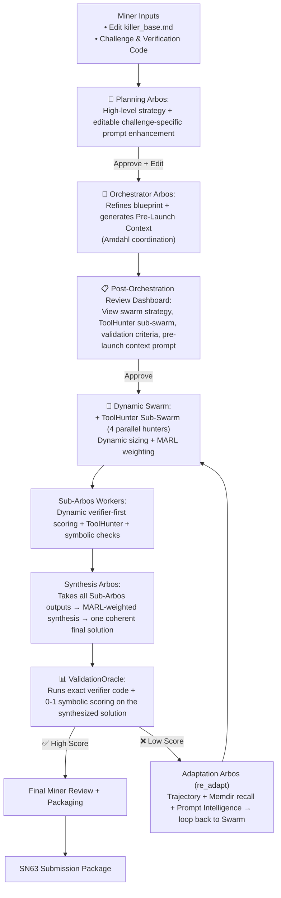

# THE ENIGMA MACHINE – Bittensor SN63 Arbos-Led Intelligent Solver

**English-first • Verifier-first • Self-evolving • Challenge-agnostic mining swarm**

Built from first principles to solve extremely hard sponsor challenges — quantum, cryptographic, mathematical, symbolic, or any well-defined problem — while maximizing novelty, ValidationOracle score, and reproducible IP.

### Miner Execution Flow

1. **Edit `killer_base.md`** — your single source of truth containing the agnostic base strategy, toggles, and English Evolution Modules.
2. **Enter the challenge + verification instructions**.
3. **Click “Generate High-Level Plan”** → Planning Arbos creates a detailed strategy and **auto-populates** a challenge-specific post-planning enhancement.
4. **Review & edit** the auto-generated Enhancement Prompt to inject your own intelligence.
5. **(Optional)** Save the edited enhancement as a Grail pattern — it appends to `killer_base.md` and stores in `memdir/grail` for future compounding.
6. **Approve the Plan** → Orchestrator Arbos refines the blueprint and generates an even-more-specific Pre-Launch Context.
7. **Post-Orchestration Review Dashboard** — Examine the full swarm strategy, ToolHunter sub-swarm recommendations, validation criteria, and pre-launch context. Override or approve before launch.
8. **Launch the Swarm** → Dynamic Swarm + coordinated ToolHunter sub-swarm (ModelHunter / ToolHunter / PaperHunter / ReadyAI-DataHunter) with Amdahl-aware parallelism.
9. **Sub-Arbos Execution** — Each worker performs dynamic verifier-first scoring, ToolHunter calls, and hypothesis exploration.
10. **Synthesis Arbos** — Aggregates all Sub-Arbos outputs, applies MARL credit assignment weighted strictly by ValidationOracle fidelity and determinism, and produces one coherent final solution.
11. **ValidationOracle** — The final gate. Executes your exact verifier code + symbolic 0-1 checks on the synthesized solution. Only high-fidelity paths advance.
12. **Low Score?** → Adaptation Arbos (`re_adapt`) automatically loops back using trajectory_vector_db + Memdir Grail recall until the score improves or the compute limit is reached.
13. **High Score?** → Grail auto-extraction + one-click SN63 packaging.

Your edits and saved Grail patterns **compound** — the miner becomes smarter and more precise with every strong run.

### System Architecture




### Key Intelligence (in system flow order)

1. **Miner Control & GOAL.md** — Single source of truth. Full control over base strategy, toggles, and English Evolution Modules.
2. **Planning Arbos** — Generates high-level strategy and automatically creates a challenge-specific post-planning enhancement (auto-populates the editable field).
3. **Enhancement Prompt Layer** — Auto-generated and fully editable. Your custom instructions (tool priorities, model preferences, novelty focus, synthesis style) propagate through all phases.
4. **Orchestrator Arbos** — Refines the plan into an executable blueprint with decomposition, swarm config, tool_map, validation criteria, and a specialized Pre-Launch Context.
5. **Post-Orchestration Review Dashboard** — Critical visibility step. Review the complete swarm strategy, ToolHunter sub-swarm recommendations, validation criteria, and pre-launch context before committing compute.
6. **Dynamic Swarm + ToolHunter Sub-Swarm** — Parallel execution with four coordinated hunters (ModelHunter / ToolHunter / PaperHunter / ReadyAI-DataHunter). Amdahl-aware routing prevents common multi-agent pitfalls.
7. **Sub-Arbos Workers** — Each performs dynamic verifier-first scoring, ToolHunter integration, hypothesis diversity, and symbolic checks.
8. **Synthesis Arbos** — Takes outputs from all Sub-Arbos workers, applies strict MARL credit assignment (weighted only by ValidationOracle fidelity and determinism), and produces one coherent final solution.
9. **ValidationOracle** — The unbreakable gate. Executes your exact verifier code snippets + SymPy invariants + 0-1 edge-case checks on the synthesized solution.
10. **Adaptation Arbos Loop** — When ValidationOracle score is low, `re_adapt` intelligently pulls from trajectory_vector_db + Memdir Grail and loops back to the swarm.
11. **Memdir Grail & Compounding Evolution** — High-score runs auto-extract invariants, best models, verifier snippets, and reflections into persistent `memdir/grail`. Miner-saved enhancements become permanent intelligence for future runs.

### Prompt Evolution Intelligence
The system is powered by layered, compounding English prompts.  
`killer_base.md` provides the challenge-agnostic foundation and English Evolution Modules.  
Planning Arbos specializes it into a challenge-specific post-planning enhancement.  
Orchestrator Arbos further refines it into a pre-launch context.  
You can edit any generated prompt and save it as a **Grail pattern**, which is automatically appended to `killer_base.md` and stored in `memdir/grail`.  

This intelligence compounds from loop to loop via Adaptation Arbos, and each new run begins with richer, proven context — allowing the miner to evolve its own intelligence across challenges without modifying any Python code.

### Strict Verification Intelligence at Every Level
Verification is enforced at every stage, not added at the end:  
- Sub-Arbos workers operate verifier-code-first with dynamic symbolic checks.  
- Synthesis Arbos only credits paths meeting strict MARL thresholds (≥0.88 symbolic fidelity, ≥0.85 determinism).  
- ValidationOracle executes your exact verifier code + SymPy invariants + 0-1 edge-case assertions on the final synthesized solution.  
- Low-scoring paths are rejected and routed to Adaptation Arbos.  

No solution reaches final review or SN63 submission unless it survives this rigorous, deterministic gate. This is the single biggest differentiator from typical LLM swarms.

### Inner + Outer Improvement Loop Intelligence

**Inner Loop (within a single run)**  
When ValidationOracle returns a low score on the synthesized solution, **Adaptation Arbos (`re_adapt`)** is automatically triggered.  

It intelligently pulls:
- The latest trajectory_vector_db entries
- Score-weighted patterns from Memdir Grail (higher ValidationOracle scores receive stronger influence)
- All built-up prompt layers (base strategy + challenge-specific enhancement + pre-launch context)

This rich, evolving context enables `re_adapt` to generate **targeted, high-signal adaptations** instead of generic retries. Each iteration becomes noticeably smarter — suggesting precise fixes (e.g., “emphasize algebraic closures and symbolic invariants on this subtask” or “escalate ModelHunter for stronger symbolic reasoning models”), avoiding low-fidelity paths, and leveraging proven patterns from earlier loops in the same run.

**The more evolved the prompts are, the more effective each inner-loop iteration becomes.**

**Outer Loop (across multiple runs)**  
High-scoring runs trigger automatic Grail extraction — symbolic invariants, best ToolHunter models, verifier snippets, and module-effectiveness reflections are saved to persistent `memdir/grail`. Miner-saved enhancements are also preserved.  

Future challenges therefore begin with richer, battle-tested intelligence, creating true long-term self-improvement. The system doesn’t just solve one challenge better — it grows fundamentally smarter over time.

### Compute Flexibility
Local GPU (Ollama) is the default for zero extra cost, but the system is **not** designed around it. Switch anytime to Chutes (remote H100), already-running endpoints, or custom hosted setups via the UI. Resource-aware logic and dynamic swarm sizing adapt to whatever compute you choose.

### Quick Start
```bash
pip install -r requirements.txt
streamlit run streamlit_app.py
```

Replace the three v4 files (`killer_base.md`, `agents/arbos_manager.py`, `streamlit_app.py`) for the full layered evolution experience.

**The bunker is open.**

Questions or feature requests? Ping @dTAO_Dad on X.

Made with focus on first-principles agentic design for Bittensor SN63.
