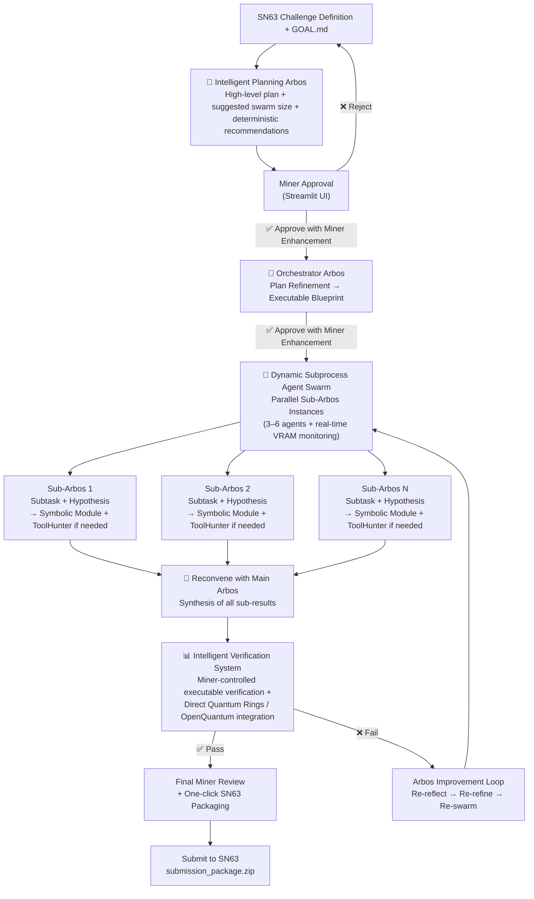

# Enigma Machine Miner – Bittensor SN63

**Arbos-centric primary solver with intelligent planning, dynamic LLM swarm, VRAM monitoring, real-time ToolHunter, miner-controlled executable verification, and automatic deterministic/symbolic tooling.**

The most intelligent and resource-efficient solo miner on Subnet 63 (Enigma). Designed from first principles to solve extremely hard, well-defined computational challenges across quantum computing and any industry — while staying strictly within the miner-defined compute limit.

### Core Architecture – The Intelligent Loop



---

### Key Intelligence Highlights

**Full Miner Control**  
Planning approval, post-planning deterministic tooling field, executable verification input, specialized/custom LLM input, enhancement prompt, final review, and one-click packaging.

**Intelligent Planning Arbos**  
Creates the high-level strategy and **explicitly recommends deterministic/symbolic tools and custom HF LLMs** (Stim for stabilizers, Quantum Rings for fidelity, PyTKET for circuit optimization, SymPy for symbolic Pauli — or models like TheBloke/Llama-3-70B-Instruct, Qwen/Qwen2-Math-7B-Instruct, etc.).

**Miner-Controlled Deterministic Tooling**  
After seeing Arbos recommendations in the planning approval screen, the miner can add or override specific tooling/model requirements before the swarm runs.

**Miner Enhancement Prompt (10/10 Instructions)**  
Dedicated field in the planning approval screen where the miner can give final custom instructions to push the entire run to maximum quality (tool priorities, novelty focus, synthesis style, verifier strength, model preference, IP/licensability, etc.). These instructions are injected into refinement and synthesis.

**Orchestrator Arbos**  
Takes the approved plan and refines it into an executable blueprint, assigning subtasks, swarm configuration, tool_map, and model classes while incorporating miner deterministic tooling/model and enhancement instructions.

**Dynamic Parallel Subprocess Agent Swarm with per-subtask ToolHunter**  
Each Sub-Arbos independently explores hypotheses and can call ToolHunter for gaps in real time. If ToolHunter fails to use a needed tool, you find out right after the swarm finishes in the ToolHunter tab — with clear, actionable messages.

**Automatic Symbolic Reasoning Module**  
Arbos swarm **automatically calls** deterministic/symbolic logic in `_sub_arbos_worker` for matching subtasks (stabilizer checks, fidelity estimation, circuit optimization, preprocessing). LLM is used only when truly needed.

**Intelligent Verification System**  
Miner can provide custom executable verification code or instructions. The system supports **direct Quantum Rings and OpenQuantum SDK integration** for real simulator execution and deterministic metrics (fidelity, shots, pass/fail). Verification results feed back into the quality gate and final synthesis.

**Adaptive Re-loop & Memory**  
Strong long-term memory across loops with explicit meta-reflection on failures. This is stored and used on future challenges. The miner keeps getting smarter and more efficient with every run.

---

### Miner Enhancement Prompt (Make this a 10/10 run)

In the planning approval screen there is a dedicated field titled **"🚀 Miner Enhancement Prompt (Make this a 10/10 run)"**.

Use it to give Arbos any final custom instructions, such as:  
- Tool priorities or constraints  
- Desired focus (novelty, verifier strength, IP/licensability, efficiency, etc.)  
- Synthesis preferences  
- Swarm behavior adjustments  
- Any other challenge-specific guidance  
- **Specific model requests** (e.g. exact Hugging Face model names)

These instructions are automatically injected into the Orchestrator refinement and final synthesis so Arbos respects them throughout the entire run.

---

### Miner-Controlled Deterministic Tooling

- Planning Arbos analyzes the challenge and shows clear deterministic tool recommendations.  
- Miner reviews them and can immediately add/edit **"Deterministic Tooling Requirements"** (e.g., "Use stim for stabilizer checks. Prefer symbolic fallbacks. Run fidelity simulation with quantum_rings.").  
- Miner has time to install any recommended tools.  
- When approved, Arbos automatically uses the symbolic module **and** respects the miner-specified preferences in the parallel swarm.

---

### Accepting Miner Models & Smart Model Hunting

**ToolHunter now includes smart model hunting**:  
- When a gap mentions models, HF, specialized capabilities, or research, ToolHunter actively searches for relevant Hugging Face models.  
- It returns the model name + **compatibility notes** (VRAM requirements, quantization options like 4-bit, etc.).  
- The miner sees these recommendations in the ToolHunter tab during final review, together with manual action options (e.g., “Rent larger GPU”, “Use 4-bit version”, “Switch to alternative endpoint”, or “Install quantized version locally”).

**How to use custom/specialized models**:  
- In the **Miner Enhancement Prompt**, simply write the exact model name you want, for example:  
  - "Use TheBloke/Llama-3-70B-Instruct for synthesis"  
  - "For stabilizer subtasks, prefer Qwen2-Math-7B-Instruct"  
- Arbos will respect the request and pass it to the LLM Router and external compute.  
- If the compute provider cannot load the model (e.g., insufficient VRAM), the system falls back gracefully to a fast/default model and logs a clear warning in the trace.

---

### Dynamic LLM Logic

The system uses a smart **LLM Router** that dynamically selects the best model for each task:  
- High-novelty, planning, orchestration, and synthesis tasks → "best" models (largest / most capable available)  
- Routine sub-tasks, verification, and ToolHunter calls → "fast" / smaller models  
- Miner can override any model choice by naming a specific model (including Hugging Face models) in the **Miner Enhancement Prompt**.  
- External compute endpoints (Chutes, custom, already-running) receive the `preferred_model` field so they can load the requested model when possible.

---

### GOAL.md / killer_base.md Configuration

```markdown
# Enigma Machine Miner - Killer Base Strategy & Toggles
# Bittensor SN63 - Arbos-centric Solver

## GOAL (MINER INPUTS: BEST INTERPRETATION OF THE CHALLENGE SOLUTION)
Solve the sponsor challenge with maximum novelty and verifier score while staying under the *DESIRED COMPUTE LIMIT*.

## Core Strategy (MINER INPUT)
Produce novel, verifier-strong, licensable solutions for SN63 challenges while staying strictly within compute limits and maximizing IP/value.

Always prioritize: (MINER INPUT)

## Toggles & Explanations

### Core Behavior
miner_review_after_loop: false     # true = pause after every major loop for miner input
max_loops: 5                       # Maximum automatic loops when review is off
miner_review_final: true           # Always require final miner review before submission

### Compute & Resource Management
compute_source: chutes             # Options: local, chutes, already_running, custom
max_compute_hours: 3.8             # Dynamic maximum compute time for the entire challenge
resource_aware: true               # Actively enforces time budgets, early aborts slow branches, adjusts swarm size

### Safety & Quality
guardrails: true                   # Applies output cleaning and sanity checks after each sub-Arbos and final synthesis

### ToolHunter
toolhunter_escalation: true        # Enables ToolHunter to generate manual recommendations on failure
manual_tool_installs_allowed: true # Shows manual installation instructions when needed

### Swarm Efficiency **(vLLM only!)**
tensor_parallel_size: 1            # Only for local compute!!
vllm_model: mistralai/Mistral-7B-Instruct-v0.2   # Change this to any model you want to use with vLLM

```

### Quick Start

```bash
pip install -r requirements.txt
pip install vllm                    # Strongly recommended
streamlit run streamlit_app.py
```

(Optional: Add `GITHUB_TOKEN` to `.env` for richer ToolHunter searches. Install `stim`, `qiskit`, `pytket`, or `quantumrings` as needed for maximum deterministic performance.)

### Why This Wins on SN63

- True intelligent decomposition with **Arbos-driven deterministic recommendations**
- **Parallel per-subtask ToolHunter** combined with automatic symbolic reasoning significantly reduces LLM reliance
- **Intelligent verification system** with direct Quantum Rings/OpenQuantum support and miner-controlled executable code
- Miner has precise control over verification, deterministic tooling, **and** final enhancement instructions
- Strong resource awareness (real-time VRAM, dynamic scaling, strict compute limits)
- Closed-loop reflection with long-term memory and full transparency

**Phase 2 ready.**

---

Made with focus on first-principles agentic design for Bittensor SN63.  
Questions or feature requests? Open an issue or ping @dTAO_Dad on X.
```
