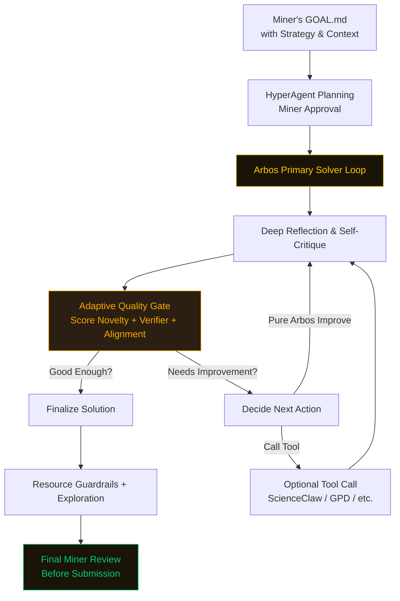

# ENIGMA MACHINE — Agentic Miner for Bittensor Subnet 63

**A high-performance reflective miner** where **Arbos is the primary solver**, with tools used only as needed.

### What Makes It Special

- Arbos is the main intelligence — it thinks, critiques, and improves the solution directly
- Full GOAL.md strategy/context is strongly injected and followed in every reflection
- Adaptive Quality Gate — Arbos scores the solution and intelligently decides whether to re-loop
- ScienceClaw is called only when Arbos determines it adds value
- Long-term memory + resource-aware guardrails
- Miner review controls (optional per-loop + always-on final review)

### How the Primary Solver Loop Works

1. Miner writes challenge + rich strategy in `GOAL.md`
2. HyperAgent generates initial plan (miner approves)
3. Arbos begins solving directly with deep reflection and self-critique
4. Arbos decides if a specialized tool is needed (ScienceClaw, GPD, etc.)
5. If needed, tool is called; otherwise Arbos continues improving the solution
6. Adaptive Quality Gate scores the current solution
7. Arbos decides: Finalize or Re-loop (up to `max_loops`)
8. Final mandatory miner review before submission

This design keeps Arbos at the center, making the loop tighter, smarter, and more focused on iterative self-improvement.


### Streamlit UI Highlights

- Challenge input + editable plan approval
- One-click Tool Study
- Debug/Trace mode showing Arbos reflections
- Final miner review before submission

### Current Strengths

- Arbos-centric design leads to deeper, more coherent reasoning
- Strong use of miner strategy from GOAL.md
- Adaptive iteration without unnecessary tool calls
- Good balance between automation and human oversight

### Quick Start

```bash
git clone https://github.com/jbequ5/Enigma-Machine-Miner.git
cd Enigma-Machine-Miner
pip install -e .
cp .env.example .env
```

**One-time Setup**
```bash
python -c "from agents.tool_study import tool_study; tool_study.study_all_tools()"
```

**Launch**
```bash
streamlit run streamlit_app.py
```

### Starter GOAL.md Template

```markdown
GOAL: Solve the sponsor challenge with maximum novelty and verifier score while staying under 3.8h on H100.

STRATEGY/CONTEXT: [Your detailed strategy, constraints, success criteria, and any specific instructions here]

# Core Toggles
reflection: 4
exploration: true
resource_aware: true
guardrails: true

# Miner Control
miner_review_after_loop: false     # true = review after every loop
max_loops: 5
miner_review_final: true

# Compute
chutes: true
chutes_llm: mixtral
```

Ready to dominate SN63?

Fork the repo, run the Tool Study, write your best strategy in GOAL.md, and launch.

**$TAO 🚀**
