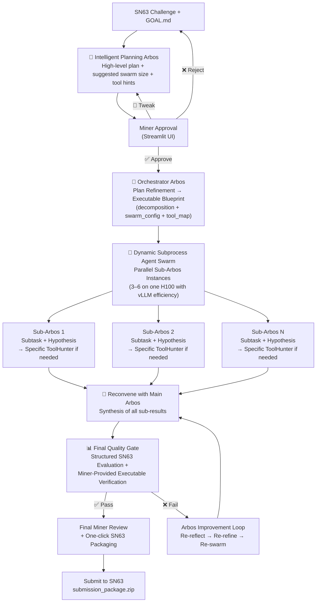

# Enigma Machine Miner – Bittensor SN63

**Arbos-centric primary solver with intelligent planning, dynamic vLLM swarm, real-time ToolHunter, and miner-insertable executable verification**

The most intelligent and resource-efficient arbos miner on Subnet 63. Designed from first principles to solve extremely hard, well-defined computational challenges across quantum and any industry — within miner defined strict compute limits.

### Core Architecture – The Intelligent Loop



**Key Intelligence Highlights**
- **Intelligent Planning Arbos** creates the high-level strategy and swarm guidance.
- **Orchestrator Arbos** intelligently breaks the problem into subprocesses with a precise `tool_map` per subtask.
- **Subprocess Agent Swarm** runs true parallel exploration with **subtask-specific ToolHunter** calls and **vLLM shared inference** for efficiency.
- **Arbos Reconvene** synthesizes results intelligently, learning from previous failed attempts via memory.
- **Adaptive Re-loop Decision** at the quality gate keeps the system reflective.
- **Miner-Insertable Executable Verification** — you can provide custom verification instructions or actual Python code per challenge that Arbos can execute to determine if reloop is needed.

### How ToolHunter Works

ToolHunter is a **dynamic meta-tool** that allows the swarm to discover, evaluate, and integrate new open source agent tools on-the-fly when the current solution has a knowledge or capability gap.

**Process**:
1. A sub-Arbos detects a gap during its reflection (or the blueprint `tool_map` flags it).
2. ToolHunter generates precise search queries and performs real searches on GitHub and arXiv.
3. It ranks candidates by relevance, GPU-friendliness, and SN63 compatibility.
4. It attempts safe cloning and basic testing in a temporary sandbox.
5. **Success** → Returns integration code + patch. The tool is stored in long-term memory.
6. **Failure** → Generates a clear **miner escalation recommendation** with copy-paste commands. This appears prominently in the final review screen if `manual_tool_installs_allowed` is true.

### GOAL.md / killer_base.md Configuration

Your main strategy and control file is **`goals/killer_base.md`**. It is strongly injected at every stage.

```markdown
## GOAL
Solve the sponsor challenge with maximum novelty and verifier score while staying under the *DESIRED COMPUTE LIMIT*.

## Strategy
Expert miner input on the problem. Strict verification guidelines. Anything at all.

## Core Toggles (Actively Used)

resource_aware: true               # Actively enforces time budgets, early aborts slow branches, adjusts swarm size
guardrails: true                   # Applies output cleaning and sanity checks after each sub-Arbos and final synthesis

toolhunter_escalation: true        # Enables ToolHunter to generate manual recommendations on failure
manual_tool_installs_allowed: true # Shows manual installation instructions in Streamlit when needed

miner_review_after_loop: false     # true = pause after every major loop for miner input
max_loops: 5                       # Maximum automatic loops when review is off
miner_review_final: true           # Always require final miner review before submission

max_compute_hours: 3.8             # Dynamic maximum compute time
chutes: true
chutes_llm: mixtral

# Swarm Efficiency (vLLM)
tensor_parallel_size: 1            # Set to 2 or 4 if you have multiple GPUs. Keep 1 for single H100
vllm_model: mistralai/Mistral-7B-Instruct-v0.2   # Change this to any model you want to use with vLLM
```

### Quick Start

```bash
pip install -r requirements.txt
pip install vllm                    # For best swarm performance
streamlit run streamlit_app.py
```

(Optional: Add `GITHUB_TOKEN` to `.env` for richer ToolHunter searches.)

### Why This Wins on SN63

- True intelligent decomposition via Planning + Orchestrator Arbos
- Parallel hypothesis exploration with per-subtask ToolHunter and vLLM efficiency
- Miner-insertable executable verification (text or Python code) per challenge
- Closed-loop reflection with strong memory across re-loops
- Full transparency and miner control at critical points

**Phase 2 ready.**

---

Made with focus on first-principles agentic design for Bittensor SN63.  
Questions or feature requests? Open an issue or ping @dTAO_Dad on X.
```
