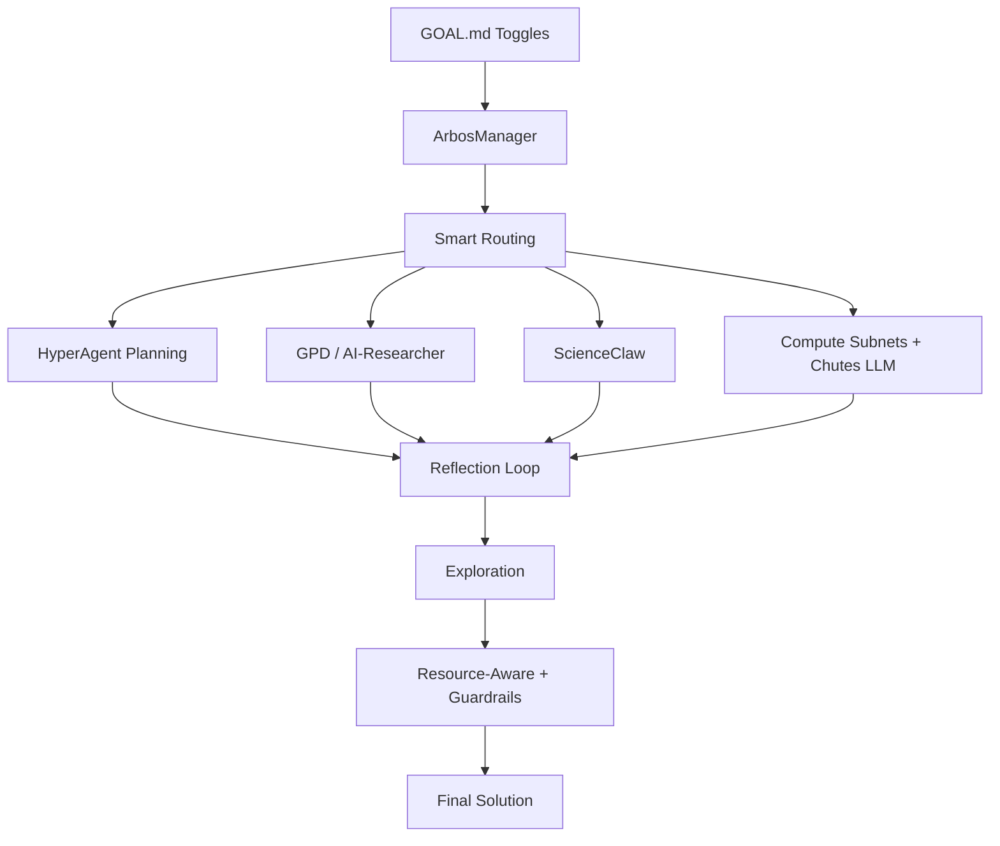

# Enigma Machine – Agentic Miner Starter Kit for SN63

**Powered by real Arbos (Const’s Ralph loop) + real GitHub tools + real Bittensor compute subnets.**  
Everything is 100% optional and controlled from one file.

### Two Modes
- **Optimal Mode** → Team-recommended settings (great for beginners)  
- **Self-Built Mode** → Full control — tune or disable anything

---

### Quickstart (5 Minutes)

```bash
git clone https://github.com/jbequ5/Enigma-Machine-Miner.git
cd Enigma-Machine-Miner
pip install -e .
```

1. Edit `config/miner.yaml` (your wallet)  
2. Choose mode in `config/arbos.yaml`  
3. Create/edit your GOAL.md  
4. Run: `./scripts/run_miner.sh`

---

### Compute Subnets + Chutes LLM Picker

| Subnet   | Best For                        | Toggle in GOAL.md          | Default |
|----------|---------------------------------|----------------------------|---------|
| Chutes   | Private LLM inference           | `chutes: true`             | true    |
| Targon   | Secure TEE GPUs                 | `targon: true`             | false   |
| Celium   | Heavy parallel compute          | `celium: true`             | true    |

**Chutes LLM Model Picker** (new):
```markdown
chutes_llm: mixtral     # Options: mixtral, llama3, gemma2, qwen2, etc.
```

**To enable real SDK performance**:
```bash
pip install chutes-sdk targon-sdk celium-sdk
```

---

### The 8 Core Patterns – All Optional

| Pattern                        | What it does                                      | Impact if enabled                              | One-line toggle in GOAL.md                    | Default |
|--------------------------------|---------------------------------------------------|------------------------------------------------|-----------------------------------------------|---------|
| Reflection                     | Self-critiques and improves output                | +3–5× quality & prize win rate                 | `reflection: 4` (or `false`)                  | 3       |
| Planning                       | Breaks challenge into smart sub-tasks             | Fewer wasted loops                             | `planning: true` (or `false`)                 | true    |
| HyperAgent Planning            | Self-improving planning                           | Much smarter plans for complex challenges      | `hyper_planning: true` (or `false`)           | false   |
| Multi-Agent                    | ScienceClaw swarm                                 | Massive breakthroughs                          | `multi_agent: true` + `swarm_size: 20`        | true    |
| Tool Use                       | Calls GPD, AI-Researcher, etc.                    | Better tool selection                          | `tool_use: true` (or `false`)                 | true    |
| Resource-Aware                 | Enforces 4h H100 limit automatically              | Required for prize eligibility                 | `resource_aware: true` (or `false`)           | true    |
| Exploration & Discovery        | Generates truly novel variants                    | Higher novelty = bigger prizes                 | `exploration: true` (or `false`)              | false   |
| Guardrails                     | Safety checks before submission                   | Prevents disqualification                      | `guardrails: true` (or `false`)               | true    |

---

### How the Patterns Work Together


### 🚀 New: Exploration & Discovery is now much stronger
When `exploration: true`, the miner:
- Pulls cross-domain inspiration from **AI-Researcher**
- Uses your chosen **Chutes LLM** (`chutes_llm`) for creative synthesis
- Runs a reflection pass for quality
- Returns structured novel variants with rationale and estimated impact

This is where top miners separate themselves and win the biggest prize pools.
---

### Killer GOAL.md Template (Copy & Customize)

```markdown
GOAL: Solve the sponsor challenge with maximum novelty and verifier score while staying under 3.8h on H100.

reflection: 4
planning: true
hyper_planning: false
multi_agent: true
swarm_size: 20
exploration: true
resource_aware: true
guardrails: true

# Compute + LLM
chutes: true
targon: false
celium: true
chutes_llm: mixtral
```

---

### How to Run the Real Miner

```bash
chmod +x scripts/run_miner.sh
./scripts/run_miner.sh
```

The miner registers on SN63, receives live challenges, runs real Arbos + tools + compute, and respects the 4h H100 limit automatically.

---

Ready to dominate Enigma?  
Fork the repo, create your first custom GOAL.md, and start competing.

$TAO 🚀
