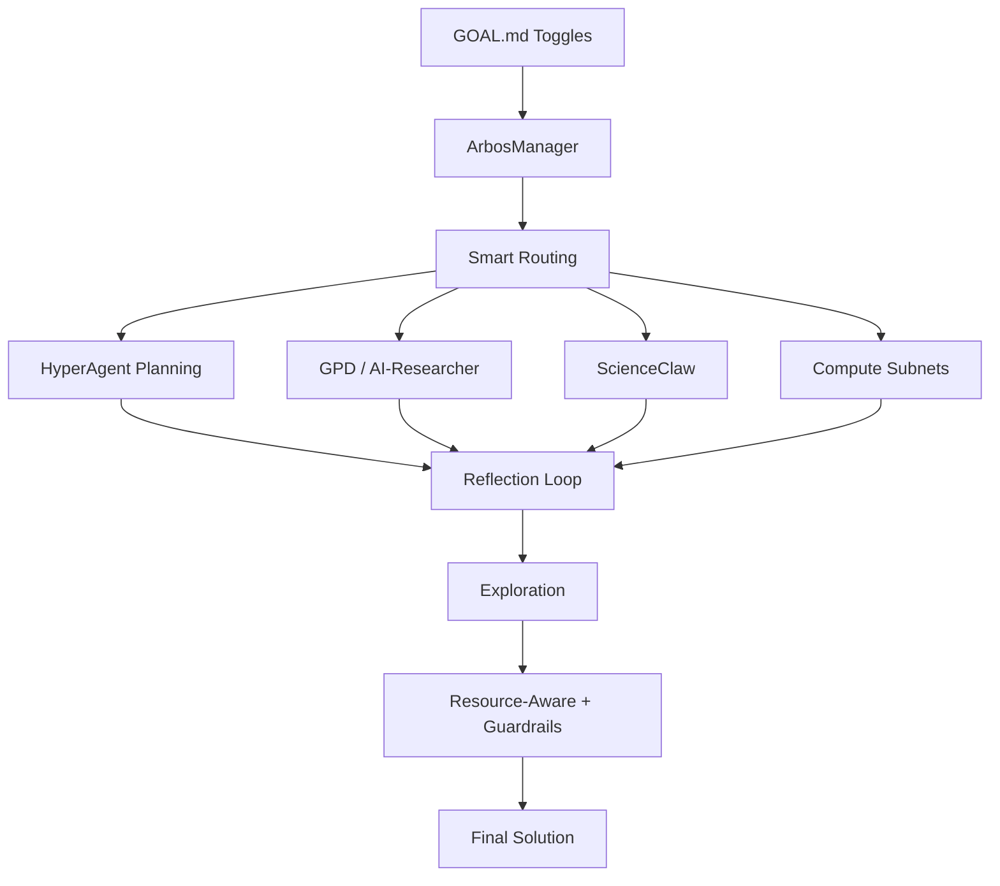

# Enigma Machine – Agentic Miner Starter Kit for SN63

**The easiest way to build a winning miner for Enigma.**  
Anyone posts capital and an “impossible” problem. Miners solve it in ≤4 hours on a single H200 GPU.

**Powered by Arbos + real GitHub tools + Bittensor compute subnets.**  
Everything is 100% optional and fully customizable via one file.

### Two Modes – Your Choice
- **Optimal Mode** → Team-recommended settings (great for beginners)  
- **Self-Built Mode** → Full control — tune or disable anything

---

### Quickstart (5 Minutes)

```bash
git clone https://github.com/YOUR-USERNAME/enigma-machine.git
cd enigma-machine
pip install -e .
```

1. Edit `config/miner.yaml` (add your wallet)  
2. Choose mode in `config/arbos.yaml`  
3. Create or edit your GOAL.md  
4. Run: `./scripts/run_miner.sh`

---

### The 8 Core Patterns – All Optional & Easy to Tune

| Pattern                        | What it does                                      | Impact if enabled                              | One-line toggle in GOAL.md                    | Default |
|--------------------------------|---------------------------------------------------|------------------------------------------------|-----------------------------------------------|---------|
| Reflection                     | Self-critiques and improves output                | +3–5× quality & prize win rate                 | `reflection: 4` (or `false`)                  | 3       |
| Planning                       | Breaks challenge into smart sub-tasks             | Fewer wasted loops                             | `planning: true` (or `false`)                 | true    |
| HyperAgent Planning            | Self-improving planning (Facebook HyperAgent)     | Much smarter plans for complex challenges      | `hyper_planning: true` (or `false`)           | false   |
| Multi-Agent                    | ScienceClaw swarm for parallel discovery          | Massive breakthroughs                          | `multi_agent: true` + `swarm_size: 20`        | true    |
| Tool Use                       | Calls GPD, AI-Researcher, etc.                    | Better tool selection                          | `tool_use: true` (or `false`)                 | true    |
| Resource-Aware                 | Enforces 4h H200 limit automatically              | Required for prize eligibility                 | `resource_aware: true` (or `false`)           | true    |
| Exploration & Discovery        | Generates novel variants                          | Higher novelty = bigger prizes                 | `exploration: true` (or `false`)              | false   |
| Guardrails                     | Safety checks before submission                   | Prevents disqualification                      | `guardrails: true` (or `false`)               | true    |

### Compute Subnets – Decentralized Compute (New!)

You can now route heavy work to real Bittensor subnets directly from your GOAL.md. No extra code needed.

| Subnet   | Best For                        | Toggle in GOAL.md          | Default |
|----------|---------------------------------|----------------------------|---------|
| Chutes   | Private LLM inference           | `chutes: true`             | true    |
| Targon   | Secure TEE GPUs                 | `targon: true`             | false   |
| Celium   | Heavy parallel compute          | `celium: true`             | true    |

**Add these lines to any GOAL.md**:
```markdown
chutes: true
targon: false
celium: true
```

Arbos automatically routes compute to the best subnet (Chutes for speed, Celium for swarms, Targon for secure work).

---

### How the Patterns Work Together



---

### Killer GOAL.md Template (Copy & Customize)

```markdown
GOAL: Solve the sponsor challenge with maximum novelty and verifier score while staying under 3.8h on H100.

reflection: 4
planning: true
hyper_planning: false
multi_agent: true
swarm_size: 20
exploration: true
resource_aware: true
guardrails: true

# Compute subnets
chutes: true
targon: false
celium: true
```

---

Ready to dominate Enigma?  
Fork the repo, create your first custom GOAL.md, and start competing.

$TAO 🚀
