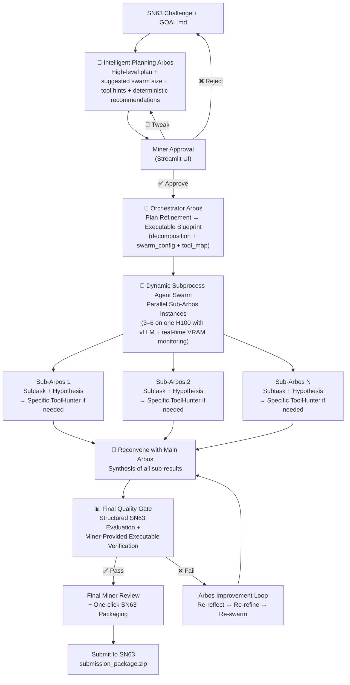

# Enigma Machine Miner – Bittensor SN63

**Arbos-centric primary solver with intelligent planning, dynamic vLLM swarm, real-time ToolHunter, miner-controlled executable verification, and deterministic tooling**

The most intelligent and resource-efficient solo miner on Subnet 63 (Quantum Innovate / qBitTensor Labs). Designed from first principles to solve extremely hard, well-defined computational challenges across quantum and any industry — within the strict ~4-hour H100 limit.

### Core Architecture – The Intelligent Loop



**Key Intelligence Highlights**
- **Intelligent Planning Arbos** creates the high-level strategy and **explicitly recommends deterministic/symbolic tools** (e.g., stim for stabilizers, quantum_rings for fidelity, pytket for optimization).
- **Miner-Controlled Deterministic Tooling** — After seeing Arbos recommendations in the planning screen, the miner can add/edit specific tooling requirements before approving the run. This gives time to install any missing tools.
- **Subprocess Agent Swarm** runs true parallel exploration with **subtask-specific ToolHunter**, vLLM shared inference, real-time VRAM monitoring, and dynamic tensor parallelism.
- **Main Arbos Reconvene** synthesizes results intelligently, learning from previous failed attempts via memory.
- **Miner-Insertable Executable Verification** — Full control over verification code or instructions.
- **Hybrid Reasoning** — Arbos prefers deterministic/symbolic fallbacks when available; falls back to LLM only when necessary.

### How Deterministic Tooling Works

1. Planning Arbos analyzes the challenge and recommends deterministic tools.
2. Miner sees recommendations in the Streamlit planning approval screen.
3. Miner adds/edits "Deterministic Tooling Requirements" (e.g., "Use stim for stabilizer checks. Prefer symbolic fallbacks. Run fidelity with quantum_rings.").
4. Miner has time to install any missing tools.
5. When approved, the swarm and synthesis respect the miner’s tooling preferences.

### GOAL.md / killer_base.md Configuration

```markdown
## Core Toggles (Actively Used)

resource_aware: true
guardrails: true
toolhunter_escalation: true
manual_tool_installs_allowed: true

miner_review_after_loop: false
max_loops: 5
miner_review_final: true

max_compute_hours: 3.8
chutes: true
chutes_llm: mixtral

# Swarm Efficiency
tensor_parallel_size: 1
```

### Quick Start

```bash
pip install -r requirements.txt
pip install vllm                    # Required for best swarm performance
streamlit run streamlit_app.py
```

(Optional: Add `GITHUB_TOKEN` to `.env` for richer ToolHunter searches.)

### Why This Wins on SN63

- True intelligent decomposition with **Arbos-driven deterministic tool recommendations**
- Miner has full control over verification **and** deterministic tooling after seeing recommendations
- Parallel hypothesis exploration with per-subtask ToolHunter + vLLM efficiency
- Strong resource awareness and real-time VRAM monitoring
- Closed-loop reflection with long-term memory
- Full transparency and miner oversight at every critical decision point

**Ready for Phase 2.**

---

Made with focus on first-principles agentic design for Bittensor SN63.  
Questions or feature requests? Open an issue or ping @dTAO_Dad on X.
