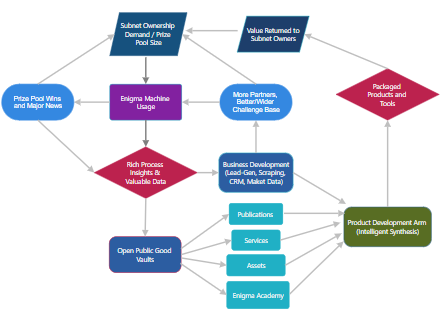

# SAGE — The Shared Agentic Growth Engine

**The People’s Intelligence Layer for Subnet 63**

## 1. The Spark

It started with a simple but powerful idea: give everyday people a real chance to compete for sponsor-funded challenges on Subnet 63 and earn meaningful rewards by solving hard, verifiable problems.

To make this possible, we built the **Enigma Machine** — a verifier-first, agentic solver designed from the ground up to turn complex challenges into high-quality, verifiable solutions. What began as a practical mining tool quickly revealed something far more significant: every single run naturally generates rich, structured process data — detailed insights into *how* intelligence actually works when tackling hard problems.

That discovery changed everything.

## 2. The Evolution

From a powerful solver, SAGE was born.

We realized the true breakthrough wasn’t just the solutions the Enigma Machine produced — it was the byproduct: the rich, high-signal process data generated with every run. Every fragment is automatically impact-scored by the memory graph using verifier-first metrics — EFS performance, heterogeneity, reuse frequency, contract value, and freshness — so only the highest-value knowledge is promoted, refined, and intelligently reinserted, creating a continuously compounding collective intelligence layer.

We saw the potential immediately. This wasn’t just mining data — it was the raw material for something far greater. By intelligently capturing, routing, and synthesizing these scored insights, we could transform individual solving activity into a shared, self-improving intelligence commons owned by the community.

This realization led to the creation of **SAGE** — the Shared Agentic Growth Engine — a complete decentralized platform where every Enigma Machine run contributes to a growing, community-owned intelligence layer that benefits all participants.

## 3. How SAGE Works: The Flywheel

Ownership demand in the subnet increases prize pools.  
Larger prize pools drive more Enigma Machine usage.  
More usage generates richer process insights and valuable data.

This data flows into two powerful systems:

### Business Development
**The demand-sensing and opportunity engine of SAGE.**

It continuously scans the real world for high-value challenges, sponsor interest, and market pain points that match the strengths of the Enigma Machine. Using live scraping, Serper, Apify, NewsAPI, GitHub, and X semantic search — combined with the rich process insights from every run — it intelligently identifies, qualifies, and prioritizes opportunities. Leads are tracked in a dedicated CRM, scored with predictive signals, and converted into sponsored challenges and partnerships that feed directly back into the subnet’s prize pools.

### Open Public Good Vaults 
**The living memory of the platform.**  

Every high-signal run intelligently feeds scored data into four permanent, append-only, provenance-rich vaults:

- **Publications** — Shared knowledge and research open to everyone. Whitepapers, technical deep-dives, solution analyses, and distilled insights from thousands of runs. This becomes the definitive public library of how agentic systems solve hard verifiable problems.
 
- **Assets** — Battle-tested verifiability contracts, solver frameworks, prompt libraries, system design templates, and modular components that miners and developers can immediately reuse and improve.
 
- **Services** — High-margin opportunities and tools. Ready-to-deploy solutions, consulting frameworks, and sponsor-matched offerings that turn raw insights into practical revenue-generating value.

- **Enigma Academy** — The crown jewel. Experiential learning modules, interactive curricula, simulation replay kits, and progressive learning paths. It teaches not just *what* was solved, but *how* intelligence works — helping the next generation of solvers and builders level up faster in the age of AI.

All vaults are open by default. Miners can choose to contribute their insights, turning individual work into permanent shared value for the community.

### Product Development
**The intelligent synthesis layer.**

Vault data, BusinessDev signals, and high-impact graph fragments converge here. Acting as a sophisticated Synthesis Agent, it debates, refines, and composes the best insights into polished, shippable products: interactive kits, reusable contract libraries, advanced simulators, and structured curricula for Enigma Academy.

Core versions remain fully open source. Premium features help sustain and grow the network while returning value to the community by reinvesting all revenue in the subnet.

## 4. The Real Shift

SAGE is designed to scale with accessible local models. Anyone with a modest setup can run the Enigma Machine, contribute meaningful process data, and benefit from the growing collective capability.

Miners are no longer just competing for prizes — they are actively building a living, community-owned intelligence layer. Contribution creates valuable data. SAGE creates shared capability. Intelligence grows with every run — and the value flows back to the people who power it.

This is the opposite of extractive corporate AI.

## 5. The Vision

SAGE is becoming the scalable **People’s Intelligence Layer** for Subnet 63.

A self-sustaining ecosystem where miners contribute runs, stakers provide capital and shared ownership, and the platform turns solving data into useful products, education, and economic opportunity — all while the flywheel continuously grows prize pools, participation, and collective intelligence.

As the vaults reach critical mass, the Product Development Arm and Enigma Academy will expand into full creative and educational platforms. Every participant becomes both a contributor to and an owner of the intelligence being created.

**Welcome to SAGE.**

The Shared Agentic Growth Engine.  
A living, community-owned system where decentralized solving data pushes humanity forward — together.
